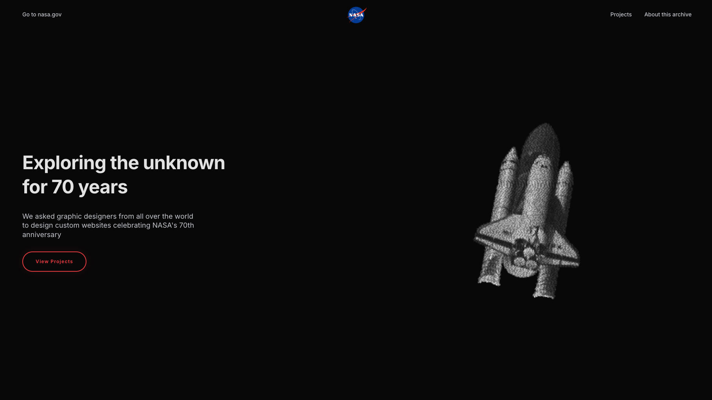
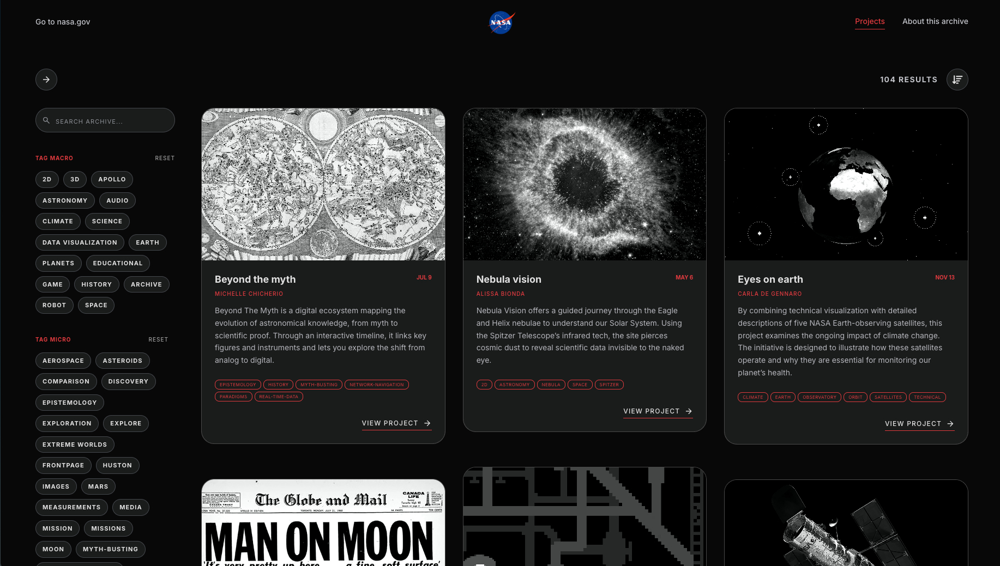

# NASA70
SUPSI 2026  
Corso d’interaction design, CV429.01  
Docenti: A. Gysin, G. Profeta  

Progetto 2: Costruzione sito NASA70

# NASA70
Autore: Melissa Broggini \
[NASA70](https://melissabroggini.github.io/NASA70/)

## Introduzione e tema
In occasione del 70° anniversario della NASA, il progetto sviluppa una piattaforma web celebrativa di terze parti volta a raccogliere e mostrare al pubblico progetti di visual design provenienti da grafici di tutto il mondo. L'artefatto non si configura come un portfolio personale, bensì come un archivio globale e istituzionale.

## Riferimenti progettuali
Il design adotta rigorosamente il codice comunicativo e i pattern strutturali tipici della comunicazione ufficiale della NASA. L'architettura dell'header e del footer è stata modellata in perfetta analogia con il sito ufficiale per conferire autorevolezza e credibilità istituzionale alla piattaforma, garantendo una familiarità immediata per l'utente.

## Design dell’interfaccia e modalità di interazione

— Landing Page ed Effetti Particellari: Un sistema di punti dinamici si scompone e si ricompone via codice per formare visivamente le quattro più grandi tappe storiche della NASA: l'allunaggio (Programma Apollo), Curiosity Rover, Voyager e lo Space Shuttle Columbia. Un bottone dedicato permette di accedere direttamente all'archivio dei progetti.

— Esplorazione e Scorrimento della Home: Procedendo con lo scrolling, l'utente incontra la sezione About this Archive, la vetrina curata con i migliori progetti scelti dagli esperti della NASA e la sezione Project of the Day.

— Navigazione dell'Archivio (Page 'Projects'): Il menu dell'header porta all'archivio completo gestito con un sistema di layout a schede (cards). Sulla sinistra è integrata una barra di ricerca affiancata da un sistema di filtri a tag, mentre in alto a destra è posizionato il menu di ordinamento. Il caricamento è ottimizzato tramite un sistema Lazy Loading che mostra un massimo di 15 card alla volta, espandibili tramite il pulsante "Load more". Cliccando su una scheda si apre la pagina di dettaglio a schermo intero del singolo progetto.

## Tecnologia usata
L'implementazione tecnica è stata realizzata interamente tramite codice semantico e logico pulito:

— HTML per l'architettura dei contenuti e metadati.

— JavaScript per la gestione dinamica dei filtri, dell'ordinamento delle card e dell'interazione asincrona.

— Antigravity come framework/libreria core per lo sviluppo coordinato e la programmazione dell'intero ecosistema di codice del sito.

## Target e contesto d’uso
Il portale si rivolge a due macro-cluster di utenti:

— Appassionati di Spazio e Astronomia: Utenti che cercano un modo alternativo ed emozionante di rivivere le tappe storiche dell'esplorazione cosmica.

— Visual Designer e Grafici: Una community internazionale interessata a scoprire nuovi approcci progettuali, tendenze estetiche, uso della tipografia e soluzioni di interaction design applicate a un tema scientifico di rilievo.
